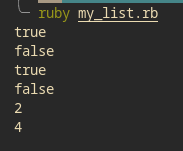

# Enumerable




## Built With

- Major languages (Ruby)

- Technologies used

  ```bash
  - Git(version control)
  - Ruby
  ```

## Getting Started

To get a local copy up and running follow these simple example steps.

### Prerequisites

- A text editor(preferably Visual Studio Code)

### Install

- [Git](https://git-scm.com/downloads)
- [Ruby](https://www.ruby-lang.org/en/documentation/installation/)

### Usage


#### Clone this repository

```bash
git clone git@github.com:Paskab012/Enumerable_ruby.git

cd Enumerable_ruby
```

#### Run project

```bash
$ ruby 
```

## Author

👤 **Vignesh**

- GitHub: [@vikipretium](https://github.com/vikipretium)
- Twitter: [@vikipretium](https://twitter.com/vikipretium)
- LinkedIn: [vikipretium](https://linkedin.com/in/vikipretium)

👤 **PASCAL KABIKA MP.**

- GitHub: [KABIKA681](https://github.com/KABIKA681?tab=overview&from=2021-12-01&to=2021-12-31)
- LinkedIn: [LinkedIn](https://www.linkedin.com/in/pascal-kabika-443061220/)

Contributions, issues, and feature requests are welcome!

Feel free to check the [issues page](../../issues/).

## Show your support

Give a ⭐️ if you like this project!

## Acknowledgments

- Add refereces and acknowlegements

## 📝 License

This project is [MIT](./MIT.md) licensed.
